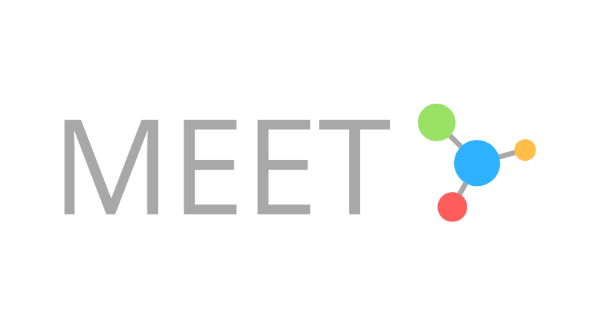

  
  <a href="https://www.einbergandying.com" target="_blank">Einberg & Ying LLP</a>

  <h1>Marqeta Extended Expense Tracker (MEET)</h1>

    
  </a>
  
  
  
  
  
   
  
   
  
  
  
  

 
 

For the **Marqeta Spring Payments Hackathon**, we wanted to demonstrate the flexibility and practicality of the Marqeta API and the Marqeta Python SDK with our demo, MEET.

## Introduction

MEET is made for the company willing to forgo tradition and move to a tool that lets you have perspective over where your company stands.

Imagine yourself as the manager of your accounting department at Einberg and Ying LLP, your traditional company of today. MEET enables you to keep track of all the expenses in your department, whether they be department wide or down to the minute employee expenditure. With transparency built into MEET as an expectation, losing track of money and having to snoop around to see what went where is a thing of the past.

One of the primary use cases of MEET is that it allows companies to follow a plan-based approach of how they want their funds to be distibuted. MEET enables managers to create plans for when they want money to be distributed to their department's employees or whether they need to transfer funds to another department. Once these plans are crated 

## Key advantages and Benefits
- Simplicity: A big benefit of MEET is its user-friendly functionalities and design. By accessing the dashboard view, a user can see all the important data and statistics of company's expenses. Additionally, for a managerial perspective, creating plans is also an easy process with a few fields to fill.

- Transparency: Business executives or department managers have viewing access to the flow of money within the departments and employees. Business executives can see how money from the business GPA is distributed to different departments. Both business executives and department managers can view the transactions made by employees.

- Accountability: Because each department and individual employees spending is recorded and accessible by a business executive or department head, any misuse of company's fund or irregularities can be easily traced to its source, thus encouraging employees to handle money more responsibly. 

- Illustrative: In adddition to providing expense tracking, there are various statistics, graphs, tables, and data visible to users. Each of these display illustrates a general standing of company's exepenses. For example, a pie chart exhibits the allocation of funds whether proportionally or disproportionally. Averages are used to encapsulate a comprehensive insight into the use of company's funds by departments, users, plans, etc. A time graph graph illustrates the change in expenses over time. 

## Audience
The intended audience is any person with a leadership position within a business who desires a streamline perspective of cashflow within different departments or individuals. 

## How we utilized Marqeta's API

Our [demo](#demo) is a web application using the following technologies:

Backend:

- Flask (Python)
- mySQL

Frontend:

- HTML
- CSS
- Javascript

We simulate the creation of Einberg and Ying LLP using the Marqeta Python SDK along with some of our own additions to it. Funding of the company account to the funding of department/employee accounts are all done automatically.

The Marqeta Python SDK is used extensively to simulate Einberg and Ying LLP's company top-down, enabling funding of the master GPA balance of Einberg and Ying down to the employee GPA's of Einberg and Ying.

## How to view our demo

Our demo follows an imaginary company called Einberg & Ying LLP who has moved their corporate expense tracking online to a tool integrating with Marqeta's API, allowing for funds to dispersed on a schedule, or at-will.

There are two ways to try out our project:

1. www.einbergandying.com

If you choose to go to our website, here are is list of available login details:

| emails  | passwords  |
|---------|:----------:|
|IT@eay.com         |    root    |
|AC@eay.com         |    root    |
| MK@eay.com        |    root    |
| HR@eay.com        |    root    |
| PD@eay.com        |    root    |
| RD@eay.com        |    root    |
| SC@eay.com        |    root    |
| LG@eay.com        |    root    |

2. Read the "technical" portion the `README` to install it yourself.

### What do each of our widgets mean?
Pictures and diagrams here

# Technical? Run it yourself!

## Requirements

Python - version must be `>= 3.7`  
MySQL - version `>= 8.0`  
pipenv

### Windows user?
Are you a Windows user? Have you ever worked in a group of people with Unix based machines? I know what that feels like!
Luckily, there are great Linux wrappers for Windows such git bash, MinTTY, cygwin, or WSL (Windows subsystem for Linux).
Install any one of these to run the shell script that starts out program.    

## Setup

Run `pipenv install` if you are cloning the project for the first time or if any new packages have been added.

## Execution

For development on a unix environment: `pipenv run server`

For development on a windows environment: `pipenv run ws`

- Note, there is no need to run `pipenv shell` before `pipenv run server` as the latter command will execute the script in the venv.

## Troubleshooting
