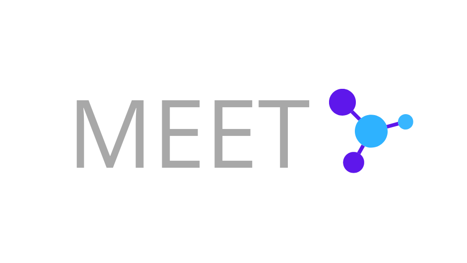

  
  <a href="https://www.einbergandying.com" target="_blank">Einberg & Ying LLP</a>

  <h1>Marqeta Extended Expense Tracker (MEET)</h1>

 
  
  
  
  
  
   
  
   
  
  
  
  

 
 

## Criterion
For the **Marqeta Spring Payments Hackathon**, we wanted to demonstrate the flexibility and practicality of the Marqeta 
API and the Marqeta Python SDK with our **demo**, MEET.

## Introduction

MEET is a platform powered by Marqeta made for companies willing to forgo tradition and move to a tool that lets you 
have perspective over where your company stands.

Imagine yourself as the manager of your accounting department at Einberg & Ying LLP, your traditional company of 
today. MEET enables you to keep track of all the expenses in your department, whether they be department wide or down 
to the minute employee expenditure. With transparency built into MEET as an expectation, losing track of money and 
having to snoop around to see what went where is a thing of the past.

One of the primary use cases of MEET is that it allows companies to follow a plan-based approach of how they want their 
funds to be distributed. MEET enables managers to create plans for when they want money to be distributed to their 
department's employees or whether they need to transfer funds to another department. Once these plans are created, 
they are inserted into your database and are checked on a scheduled basis, allowing for strict management of company 
funds. These plans are only executed once their start date is reached and stopped in the same manner (when their stop 
date is reached). 

## Key advantages and Benefits of MEET

- Marqeta: Marqeta's Python SDK allows for consistent management of business entities such as employees and funding
accounts. It simplifies expense management allowing companies to know exactly where money is designated.

- Transparency: Business executives or department managers have viewing access to the flow of money within the 
departments and employees. Business executives can see how money from the business GPA is distributed to different 
departments. Both business executives and department managers can view the transactions made by employees.

- Accountability: Because each department and individual employees spending is recorded and accessible by a business 
executive or department head, any misuse of company's fund or irregularities can be easily traced to its source, thus 
encouraging employees to handle money more responsibly. 

- Illustrative: In addition to providing expense tracking, there are various statistics, graphs, tables, and data 
visible to users. Each of these display illustrates a general standing of company's expenses. For example, a pie chart 
exhibits the allocation of funds whether proportionally or disproportionally. Averages are used to encapsulate a 
comprehensive insight into the use of company's funds by departments, users, plans, etc. A time graph graph illustrates 
the change in expenses over time. 

## Audience
The intended audience is any person with a leadership position within a business who desires a streamline perspective 
of cash-flow within different departments or individuals. 

## How we utilized Marqeta's API through our demo

MEET is simply an expense manage management platform which is demonstrated through a fake company we created. When
our server starts, we simulate in certain stages. The first stage involves creating a fake company and employees. A certain
amount of money is randomly generated and inserted into the main business. Later, new departments are created and employees
are randomly placed in those departments. Afterwards, we run simulations on spending to make it look like a certain
percentage of employees have spend parts of the department's money; all by the time you login.

**In effect, this means that very little of the information you see on your screen is hard-coded/pre-determined, 
and that two factors: time along with the creation of new plans will have an effect on the dashboard overview data 
that you see.** 

The Marqeta Python SDK is used extensively to simulate Einberg & Ying LLP's spending, enabling funding of the 
master GPA balance of Einberg & Ying to trickle down to the individual employee GPA's.

### MEET platform structure

We access several Marqeta API endpoints to create business accounts, department accounts, employee accounts, and
virtual cards. In the following diagram, symbolic names are bolded whereas API endpoints are labeled with "API":  

### User Interface

The dashboard overview has generalized data for the entire company and your department  

  

The new plan form allows you to create a new plan for employees. The funds can be distributed to a department
account or to individual employees' accounts in the company. Hover over the labels to view helpful tooltips.    

  

## How to view our demo
There are two ways to view/try out the project:

1. www.einbergandying.com

    If you choose to go to our website, here are is list of available login details (each name represents a different
    department):
    
    | email  | password  |
    |---------|:----------:|
    | AC@eay.com         |    root    |
    | IT@eay.com         |    root    |
    | MK@eay.com         |    root    |
    | HR@eay.com         |    root    |
    | PD@eay.com         |    root    |
    | RD@eay.com         |    root    |
    | SC@eay.com         |    root    |
    | LG@eay.com         |    root    |

2. Read the "technical" portion the `README` to install it yourself.

# Technical? Run it yourself!

## Requirements

- Python - version must be `>= 3.7`  
- MySQL - version `>= 8.0`  
- pip + pipenv

### Windows user?
Are you a Windows user? Have you ever worked in a group of people with Unix based machines? I know what that feels like!
Luckily, there are great Linux wrappers for Windows such git bash, MinTTY, cygwin, or WSL (Windows subsystem for Linux).
Install any one of these to run the shell script that starts out program.    

## Setup

Run `pipenv install` if you are cloning the project for the first time or if any new packages have been added.

## Execution

For development on a unix based environment: `pipenv run server`

For development on a windows environment: `pipenv run ws`

- Note, there is no need to run `pipenv shell` before `pipenv run server` as the latter command will execute the script 
in the venv.